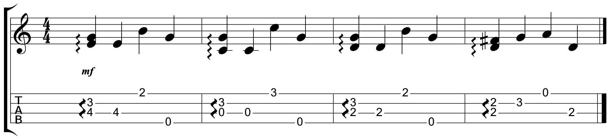

#资源仓库
***
1. [ pfzl 平凡之路](https://github.com/zzc1231/ukulele/blob/master/Res/pfzl/README.md#平凡之路)

   |文件名 |预览|内容|全局路径|
   |----|----|----|----|
   |1 |     | 主歌 | https://raw.githubusercontent.com/zzc1231/ukulele/master/Res/pfzl/1.png         |
   |2 |     | 副歌 | https://raw.githubusercontent.com/zzc1231/ukulele/master/Res/pfzl/2.png         |
   |r1|    | 扫弦 | https://raw.githubusercontent.com/zzc1231/ukulele/master/Res/pfzl/r1.png        |
   |r2|    | 扫弦 | https://raw.githubusercontent.com/zzc1231/ukulele/master/Res/pfzl/r2.png        |
   |tab1|   | 前奏 | https://raw.githubusercontent.com/zzc1231/ukulele/master/Res/pfzl/tab1.png        |

1. 模板

   |文件名 |预览|内容|全局路径|
   |----|----|----|----|
   | 1     |        |       主歌 |    https://raw.githubusercontent.com/zzc1231/ukulele/master/Res/pfzl/1.png      |
